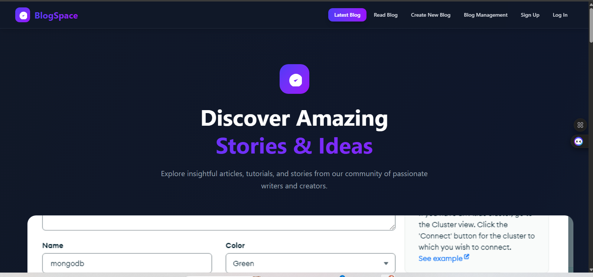

# MERN Blog Application

[](./LICENSE) [](CONTRIBUTING.md) [](CODE_OF_CONDUCT.md)

A full‑stack blog platform built with MongoDB, Express, React (Vite) and Node.js. Users can register, authenticate with JWT, create posts with images, manage categories, and browse posts in a responsive UI.

---

## Quick links

- Server entry: `server/server.js`
- Server models: `server/models/Post.js`, `server/models/User.js`
- Controllers: `server/controllers/postController.js`, `server/controllers/userController.js`
- Auth middleware: `server/middleware/Protect.js`
- Client source: `client/blog/src/`
- Client API helper: `client/blog/src/services/api.jsx`
- CI workflows: `.github/workflows/server.yml`, `.github/workflows/client.yml`

---

## Features

- JWT authentication (register / login)
- Create / update / delete posts with image upload
- Categories and basic tagging
- Comments and view counts
- Slug generation and timestamps on posts
- Responsive React + Tailwind UI (Vite)

---

## Quick start (local)

Prerequisites
- Node.js (recommended v18+)
- pnpm (recommended) or npm

Clone and install

```bash
git clone <https://github.com/Ismai21k/Blog-App.git>
cd Blog-Application
pnpm install
```

Server

```bash
cd server
cp .env.example .env   # add your values
pnpm install
pnpm start             # or pnpm dev if configured
```

Client

```bash
cd client/blog
pnpm install
pnpm run dev
```

The client expects the API base URL in an environment variable (see `client/blog/.env` / `VITE_API_BASE_URL`).

---

## Environment variables

Server (`server/.env`) - common variables to set:

- `PORT` — server port (default 5000)
- `MONGO_URI` — MongoDB connection string
- `JWT_SECRET` — secret used to sign JWT tokens
- Cloudinary (if used): `CLOUDINARY_CLOUD_NAME`, `CLOUDINARY_API_KEY`, `CLOUDINARY_API_SECRET`

Client (`client/blog/.env`)

- `VITE_API_BASE_URL` — e.g. `http://localhost:5000` or your production API URL

---

## API (examples)

- POST `/register` — register a user
- POST `/login` — login and receive JWT
- GET `/posts` — list posts (pagination / filter by category)
- GET `/posts/:id` — single post
- POST `/posts` — create (protected; multipart/form-data for images)
- PUT `/posts/:id`, DELETE `/posts/:id` — update / delete (protected)

Refer to `server/routes/` and `server/controllers/` for the exact route names and payloads.

---

## CI / Deployment

- Backend: there is a workflow `.github/workflows/server.yml` which triggers on pushes to `main` affecting `server/**` and will trigger a deploy to Render (requires `RENDER_SERVICE_ID` and `RENDER_API_KEY` secrets).
- Frontend: `.github/workflows/client.yml` targets `client/blog/**` and includes build + deploy to Vercel (requires Vercel secrets).

Notes:
- If a workflow doesn't trigger, check the `paths:` filter and the branch you pushed to. GitHub Actions uses forward slashes in globs (e.g. `client/blog/**`).
- The client uses `pnpm` (there is a `pnpm-lock.yaml`). Configure the workflow to install `pnpm` before running `pnpm install` (or use Corepack) and ensure caching steps point at `client/blog/pnpm-lock.yaml`.

---

## Troubleshooting

- "Some specified paths were not resolved" — the cache action couldn't find the lockfile you referenced; point `cache-dependency-path` at `client/blog/pnpm-lock.yaml` (for pnpm) or remove caching.
- "pnpm not found" — ensure you install / enable pnpm on the runner (use `pnpm/action-setup@v2` or enable Corepack and prepare pnpm before running `pnpm`).
- "npm ci requires a package-lock.json" — don't use `npm ci` if you use pnpm; either commit a `package-lock.json` or switch workflows to `pnpm install`.

---

## Testing

- Server tests (if present) live in `server/` and can be run with: `cd server && pnpm test`.
- Client tests (if present) live in `client/blog` and can be run with: `cd client/blog && pnpm test`.

---

## Helpful files

- `server/server.js` — express server entry
- `server/controllers/postController.js` — post logic
- `server/models/Post.js`, `server/models/User.js` — mongoose models
- `client/blog/src/services/api.jsx` — client API functions and base URL
- `.github/workflows/*.yml` — CI / deployment workflows

---

## Contributing

Contributions are welcome. Please read `CONTRIBUTING.md` for the recommended workflow: filing issues, creating branches from `main`, running tests, and opening pull requests. Small, focused PRs are easier to review — include tests and update documentation when appropriate.

If you would like templates (issue/PR) or a `CODE_OF_CONDUCT.md`, I can add them.


## License

MIT

---

If you'd like, I can also add a short "Contributing" section and example `.env` templates to this README. Let me know which you'd prefer.
[](https://classroom.github.com/online_ide?assignment_repo_id=19922269&assignment_repo_type=AssignmentRepo)
# MERN Blog Application

A full-stack blog platform built with MongoDB, Express.js, React.js, and Node.js. Users can register, log in, create posts with featured images, comment, and browse posts by category.

## Features

- User registration and login (JWT authentication)
- Create, edit, delete blog posts
- Upload featured images for posts
- Comment on posts
- Category management
- Responsive UI with React and Tailwind CSS
- RESTful API with Express and Mongoose

## Project Structure

```
client/           # React front-end
  blog/
    src/
      components/
      pages/
      services/
      hooks/
      context/
    public/
    package.json

server/           # Express.js back-end
  controllers/
  models/
  routes/
  middleware/
  uploads/        # Uploaded images
  config/
  server.js
  package.json
```

## Getting Started

### Prerequisites

- Node.js (v18+)
- MongoDB (local or Atlas)
- npm or pnpm

### Setup

1. Clone the repository
2. Install dependencies in both `client/blog` and `server` folders:
   ```sh
   cd server
   npm install
   cd ../client/blog
   npm install
   ```
3. Create `.env` files in both `client/blog` and `server` using `.env.example` as reference.
4. Start MongoDB locally or set up Atlas.
5. Start the server:
   ```sh
   cd server
   npm start
   ```
6. Start the client:
   ```sh
   cd client/blog
   npm run dev
   ```

## API Endpoints

### Posts

- `GET /api/posts` - Get all posts
- `GET /api/posts/:id` - Get a single post
- `POST /api/posts` - Create a post (protected, supports image upload)
- `PUT /api/posts/:id` - Update a post (protected)
- `DELETE /api/posts/:id` - Delete a post (protected)

### Categories

- `GET /api/categories` - Get all categories
- `POST /api/categories` - Create a category (protected)

### Users

- `POST /api/register` - Register a new user
- `POST /api/login` - Login

## Image Upload

- Images are uploaded via the `/api/posts` endpoint using `multipart/form-data` with the field name `featuredImage`.
- Uploaded images are served from `/uploads/<filename>`.

## Environment Variables

See `.env.example` in both `client/blog` and `server` for required variables.

## Screenshots



## License
.
MIT

---

For more details, see [Week4-Assignment.md](Week4-Assignment.md).
